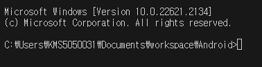

# Flutter firebase 연동프로젝트

- `auth(인증)`, `fireStore(DBMS)`, `real Database(DBMS)` 등을 연동하여 프로젝트를 구현할수 있다
- 다른 프로젝트(react)에서는 Hosting 등도 사용할 수 있다.

## firebase-auth

- `firebase`를 통하여 `Email 방식의 회원가입` ,` Email 방식의 로그인`을 구현할수 있다.
- `google login`등 `oAuth2(인증Token방식)`방식의 인증을 구현할 수 있다.

## DBMS 연동 :fireStore, real Database

- `NoSQL`방식으로 Data CRUD 를 구현할 수 있고,
- `1:1` 방식의 채팅구현
- `Message` 전달 등도 구현

## Flutter와 firebase 를 연동하기 위하여 사전 도구 설치

- Cli 도구 설치 : `npm install -g firebase-tools`
- 기존 설치 및 업데이트 :`npm install -g firebase-tool@latest`
- 설치확인 : `firebase --version`

## firebase 프로젝트 생성하기

- `firebase.google.com` 사이트에서 새로운 프로젝트 생성하기

- 생성된 프로젝트에 flutter 앱 추가하기
  
  

-`firebase-Cli`명령을 실행하여 프로젝트 구성하기 : 첫번째줄만 터미널 입력


- vscode에서 윈도우 cmd 창 열기 :`flutterfire` 명령은 윈도우 cmd 창에서만 실행됨
  
  

- 새로 생성한 프로젝트로 폴더 이동하기 : `cd flutter-008 firebase`
- 프로젝트 폴더에서 config 명령 실행 : `flutterfire configure --project=flutter-my-app-18a52`

- 명령 실행후 경고가 나오면 시스템 path에 경로 등록
  
  `C:\Users\KMS5050031\AppData\Local\Pub\Cache\bin` 등록

- cmd 창에서 명령 실행한 후 적용할 대상 선택
  

## 프로젝트에 dependency 설정하기

- console 화면에서 firebase plugin 설정으로 진행하기
  
- 화면상단에서 android 선택하고 절차대로 진행
  

```bash

firebase login
flutter pub add firebase_core
flutter pub add firebase_auth

```

- dependeny 를 정상적으로 설치했는데, app 실행에 문제가 발생하는 경우가 가끔있다.
  dependeny 들의 version 이 서로 맞지 않아서 발생하는 경우가 있다 이때는 다음 명령으로 clean을 실행한다

```bash
flutter pub upgrade outdated package
flutter clean
flutter pub get

```
