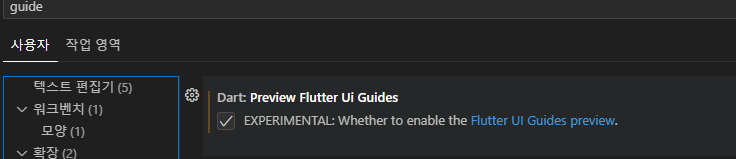

# vsCode flutter 개발환경

- extention 설치
  

- 자동완성성 세팅 :`설정`에 접속하여 실행

-codeAction On Save 에서 : `setting.json 편집`클릭

-다음 항목 추가

- widget tree guide 추가하기
- 설정에서 `guide`검색하여 `Dart preview flutter UI Guide` 체크 표시
  
